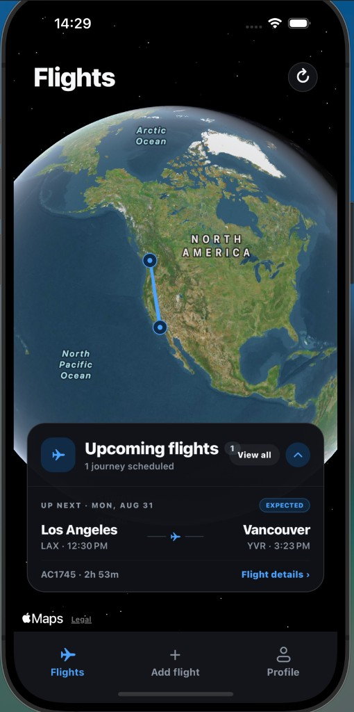
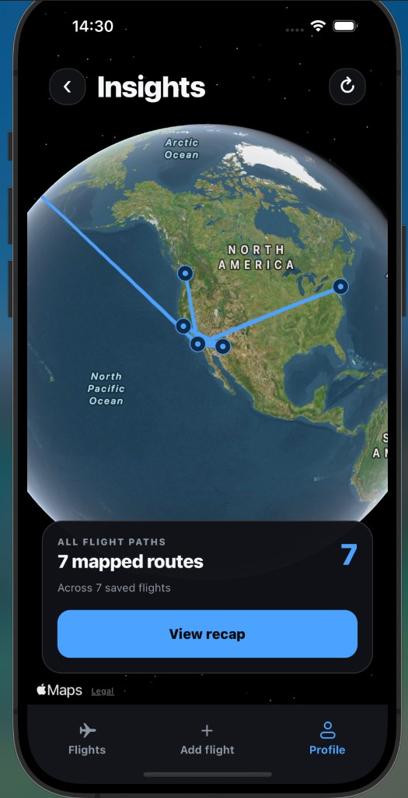

# Flight Tracker

A personal flight-history app built with Expo Router, React Native, TypeScript, and Supabase. It lets me look up flights, keep a private travel history, and revisit every route on an interactive globe and in yearly recaps.

[Watch the recorded walkthrough](https://youtu.be/ZIx8ffsGgGk)

<p align="center">
  
  
</p>

## Why I built it

[Flighty](https://www.flighty.com/) was the primary product reference. I liked its approach to presenting flight history, but the recurring subscription prompts made it a poor fit for what I wanted: a focused flight diary for my own use. I built this independent implementation so I could own the workflow, data model, and technical decisions behind the experience.

This project does not claim an original product category or feature parity with Flighty, and it is not affiliated with or endorsed by Flighty. Its portfolio value is in independently implementing and adapting the experience across Expo and Supabase: secure flight lookup, private data isolation, real-world flight-number parsing, cross-platform route visualization, and a maintainable application architecture.

The personal-use product, its code-side portfolio hardening, and the recorded walkthrough are complete. A hosted demo remains an optional presentation artifact.

## Current features

- Globe-first Flights screen with the next journey surfaced in a floating panel
- Dedicated upcoming/history list with reusable flight cards
- Two-step flight search by flight number and departure date
- Flight-number parsing for alphanumeric airline designators such as `R3`, `F9`, and `3U`
- Native calendar selection on iOS and Android
- AeroDataBox flight data proxied through a Supabase Edge Function
- Provider-independent flight result normalization
- Dedicated responsive login and sign-up screen with password recovery
- Session-protected app routes with persisted authentication
- Search-result confirmation with optional seat and notes
- Private Supabase-backed history split into upcoming and completed flights
- Flight details, personal-field editing, manual-itinerary editing, and confirmed deletion
- Manual flight entry when provider lookup is unavailable
- Row-level security for all personal flight records
- Global airport coordinate and country metadata from OurAirports
- Full-screen all-time flight-path globe on web, iOS, and Android
- Airline, airport, country, and aircraft summaries
- Separate all-time/yearly Recap page with flight, distance, and time-aloft totals
- Shared design tokens for typography, spacing, radii, controls, and main-tab alignment
- Persistent per-user and HMAC-hashed-IP search rate limits
- Fifteen-minute normalized provider-result caching
- Portable private-data export and cascading account deletion
- Unit, database authorization, and continuous-integration checks

Project documentation:

- [`docs/PRODUCT_REQUIREMENTS.md`](docs/PRODUCT_REQUIREMENTS.md) defines the product problem, users, requirements, journeys, success metrics, milestones, and risks.
- [`docs/DESIGN.md`](docs/DESIGN.md) defines the technical architecture, request flows, data model, API contract, engineering decisions, security, testing, and rollout plan.
- [`docs/WALKTHROUGH.md`](docs/WALKTHROUGH.md) provides the safe deployment checklist and three-minute portfolio recording script.

## Requirements

- Node.js 22 LTS (see `.nvmrc`)
- npm
- Expo Go or an iOS/Android simulator
- A Supabase project

## Start the app

```sh
nvm use
npm install
cp .env.example .env.local
npm start
```

Then add your Supabase project URL and publishable key to `.env.local`. Both values are available from the Supabase project's **Connect** dialog. The publishable key is designed for client apps; never add a `service_role`, provider API key, or other secret to an `EXPO_PUBLIC_` variable.

## Supabase

The app client lives in `src/lib/supabase.ts`. It uses Expo SQLite's local-storage implementation to persist auth sessions and only creates the client after credentials are present.

Apply all migrations with the Supabase CLI after linking the project:

```sh
npx supabase login
npx supabase link --project-ref YOUR_PROJECT_REF
npx supabase db push
```

The migrations create `profiles`, `flights`, the read-only airport reference table, a server-only provider cache, and persistent search-rate buckets. They import 4,134 scheduled-service airports; backfill coordinates, countries, and missing route distances; create indexes and enrichment triggers; and enforce row-level security that isolates every user's data. A narrowly granted `delete_own_account()` RPC deletes the authenticated Auth user so profile and flight records cascade.

The airport import is generated from the public-domain [OurAirports dataset](https://ourairports.com/data/). Before this migration is deployed for the first time, its checked-in snapshot can be refreshed with:

```sh
node scripts/generate-airport-migration.mjs
```

After the import migration has been deployed, do not rewrite it. Generate a new timestamped migration for later dataset refreshes.

## Authentication and history

Signed-out users land on a dedicated responsive authentication screen with login, account creation, password visibility controls, inline validation, actionable errors, and password-reset email requests. The auth screen keeps a consistent layout across modes and expands the sign-up form downward without moving its header or mode controls.

Expo Router protects the complete tab and detail route tree until `AuthProvider` restores a valid persisted Supabase session. Authenticated users enter the **Flights** tab; the **Profile** tab provides sign-out, export, and account-deletion controls. Search and all history operations require an authenticated session.

After selecting a search result, the confirmation screen:

1. Displays the airline, route, scheduled times, and status.
2. Accepts optional seat and personal notes.
3. Saves through the Supabase Data API with the authenticated user's ID.
4. Treats the database uniqueness constraint as duplicate protection.

The **Flights** tab queries only records visible through RLS and opens on an immersive globe with upcoming routes and a next-flight panel. **All flights** separates upcoming and completed journeys into a chronological list and refreshes whenever it regains focus. A saved flight can be opened to edit seat or notes, edit a manually entered itinerary, or delete the record after confirmation.

When lookup fails or returns no matches, **Enter flight manually** creates a record without a provider request. Manual entry validates required fields, three-letter airport codes, and arrival-after-departure ordering.

The signed-in **Profile** tab can export the authenticated profile and all RLS-visible flights as versioned JSON. On iOS and Android it opens the native share sheet; on web it downloads the file. Account deletion requires a second destructive confirmation and permanently removes the Auth user, profile, and cascading flight rows.

## Travel insights

The **Flight insights** entry in Profile opens an all-time, full-screen globe derived from the signed-in user's RLS-protected flight rows. Every loaded route with endpoint coordinates is drawn on the globe. A floating panel links to a dedicated **Recap** page, which includes:

- All-time or year-specific flight, distance, and time-aloft totals
- Ranked airline, airport, country, and aircraft summaries
- Partial-data handling so a missing distance, aircraft, or airport match does not remove the flight from unrelated totals

The globe always represents all loaded history; selecting a year changes only the Recap metrics and rankings. Native builds use React Native Maps, while the web renderer projects every mapped route onto the app's globe visualization.

Airport metadata is optional on each flight during rollout. Applying the Phase 3 migrations backfills existing rows and enriches future inserts automatically.

The native map works in Expo Go. Before producing a standalone Android build, configure a Google Maps SDK for Android key through Expo's `android.config.googleMaps.apiKey`. Restrict the key to the Android application and the Maps SDK rather than treating it as a server-side secret.

## Flight search

The **Add flight** tab uses this flow:

1. Enter a flight number, such as `UA 120`, `R3 501`, or `F9 1191`.
2. Choose the departure date with the native calendar.
3. The app invokes the `search-flights` Supabase Edge Function.
4. The function queries [AeroDataBox](https://aerodatabox.com/) through RapidAPI.
5. Results are normalized and rendered with the app's existing flight cards.

The RapidAPI key remains in Supabase and never ships in the app bundle.

Set it up once:

1. Create a RapidAPI account and subscribe to the AeroDataBox **Basic (free)** plan.
2. Link the local project to Supabase:

```sh
npx supabase login
npx supabase link --project-ref YOUR_PROJECT_REF
```

3. Store the RapidAPI key without writing it to shell history:

```sh
read -s "RAPIDAPI_KEY?Paste RapidAPI key: "; echo
npx supabase secrets set AERODATABOX_API_KEY="$RAPIDAPI_KEY"
unset RAPIDAPI_KEY
```

4. Set a separate random secret used to HMAC IP addresses before rate-limit storage:

```sh
RATE_LIMIT_SECRET="$(openssl rand -hex 32)"
npx supabase secrets set RATE_LIMIT_IP_HASH_SECRET="$RATE_LIMIT_SECRET"
unset RATE_LIMIT_SECRET
```

5. Deploy the function:

```sh
npx supabase functions deploy search-flights
```

For local Edge Function development, add `AERODATABOX_API_KEY=your-rapidapi-key` and `RATE_LIMIT_IP_HASH_SECRET=a-long-random-value` to `supabase/.env.local` (already ignored by Git), then run:

```sh
npx supabase functions serve search-flights --env-file supabase/.env.local
```

The function requires a valid Supabase user token (`verify_jwt = true` in `supabase/config.toml`) and validates that token before each search. Valid requests consume persistent fixed-hour limits of 10 requests per user and 30 per HMAC-hashed IP. Normalized results, including empty responses, are cached for 15 minutes before another provider request is allowed.

## Architecture

```text
Expo app
  ├─> Supabase Auth session
  ├─> search-flights Edge Function
  │     -> persistent user/IP limits
  │     -> normalized provider cache
  │     -> AeroDataBox via RapidAPI
  │     -> confirmation
  └─> private Postgres history protected by RLS
        -> airport enrichment trigger
        -> globe-first history and client-side insights
              ├─> all-time web/native flight-path globe
              └─> separate totals, rankings, and yearly Recap page
        -> JSON export and cascading account deletion
```

The Edge Function validates the session, flight number, and date; applies persistent abuse controls; serves fresh cache hits; times out provider calls; and returns stable errors for rate, quota, and provider failures. The client formats airport-local times, prefers revised or actual times when available, paginates history and exports, and computes insights only from rows visible to the authenticated user.

## Delivery status

- Complete: search foundation, authenticated personal history, travel insights, automated tests, CI, persistent rate limiting, provider caching, data export, and account deletion.
- Release artifact: deploy the configured app or record the workflow in [`docs/WALKTHROUGH.md`](docs/WALKTHROUGH.md).

## Current limitations

- AeroDataBox coverage is not uniform, and the free plan has a limited monthly quota.
- Manual-entry date pickers currently interpret times in the device time zone.
- Live tracking and notifications are out of scope for the portfolio MVP.

## Project shape

```text
src/app/             Expo Router screens and tabs
src/components/      Reusable domain and UI primitives
src/hooks/           Shared authentication and flight-loading state
src/lib/             Pure domain helpers, route builders, and integrations
src/providers/       Persisted authentication state
src/types/           Database and app-domain types
scripts/             Repeatable data-generation utilities
supabase/functions/  Edge Functions (flight search proxy)
supabase/migrations/ Database schema, RLS, caching, limits, airport import, and backfill
supabase/tests/       pgTAP authorization and cascade tests
tests/                Vitest unit tests for domain and shared utilities
.github/workflows/    CI checks
```

## Useful checks

```sh
npm run lint
npm run typecheck
npm run test
npm run doctor
```

Run every app-side check with `npm run check`. Database authorization tests require Docker and the Supabase CLI:

```sh
npx supabase start
npx supabase test db
```

GitHub Actions runs the app checks, Deno Edge Function type-checking, and the database test suite for pull requests and pushes to `main`.

The final hosted-demo, recording, and CI URLs belong in [`docs/WALKTHROUGH.md`](docs/WALKTHROUGH.md) once those external release artifacts exist.
