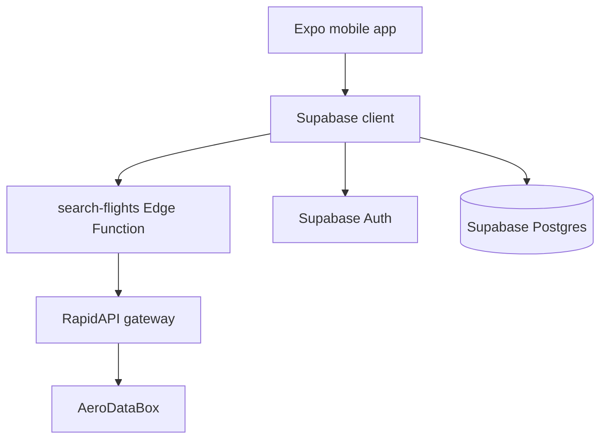
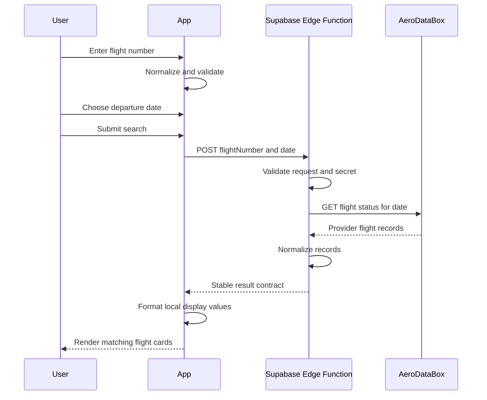
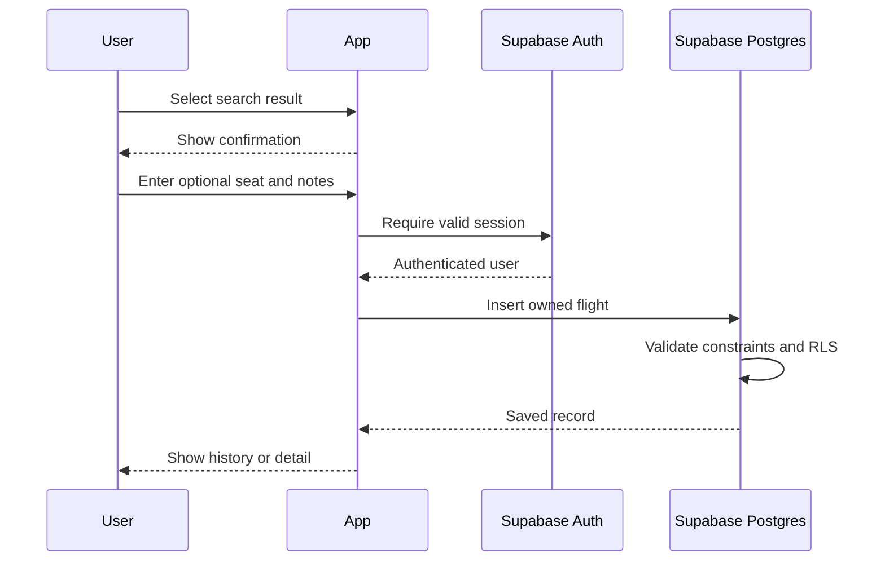

# Flight Tracker System Design

**Author:** Jace Kasen  
**Reviewers:** TBD  
**Status:** Working design  
**Last updated:** August 22, 2026  
**Related document:** [`PRODUCT_REQUIREMENTS.md`](PRODUCT_REQUIREMENTS.md)

## 1. Document overview

### Overview

This document describes the technical design for Flight Tracker, an Expo mobile application that searches external aviation data through a Supabase Edge Function and will persist private user flight history in Supabase Postgres.

The current implementation completes the search path:

```text
Expo app -> Supabase Edge Function -> RapidAPI -> AeroDataBox
```

The next implementation phase adds Supabase Auth, search-result confirmation, persistence, manual entry, and a database-backed history timeline.

### Introduction

Flight history combines several concerns that require explicit design:

- Flight numbers are reused across dates and may be codeshared.
- Departure and arrival use different local time zones.
- Historical provider coverage is incomplete.
- External API credentials cannot be shipped in a mobile bundle.
- Personal trips, seats, and notes must be isolated by user.
- The free provider has limited quota and no application-level reliability guarantee.

The architecture uses a provider-independent contract at the Edge Function boundary, UTC timestamps for storage and calculations, airport-local values for display, and Supabase RLS for ownership enforcement.

## 2. Goals and non-goals

### Goals

- Provide a secure server-side boundary for external flight lookup.
- Keep the mobile application independent of AeroDataBox response formats.
- Persist private flight history with enforceable user isolation.
- Correctly handle airport-local and UTC timestamps.
- Tolerate incomplete provider records and provider outages.
- Support manual records without requiring external data.
- Keep the portfolio MVP operationally simple and inexpensive.
- Provide enough detail for implementation, testing, review, and maintenance.

### Non-goals

- Airline-grade uptime or operational accuracy.
- Continuous aircraft position ingestion.
- Push-based status alerts in the MVP.
- Booking, payment, check-in, or ticket management.
- Multi-region backend infrastructure.
- Premature microservice decomposition.
- A generalized aviation-data platform.

## 3. System architecture

### High-level architecture



### Core components

#### 1. Mobile application

Technology:

- Expo SDK 57
- Expo Router
- React Native
- TypeScript
- Supabase JavaScript client
- Expo SQLite local-storage adapter
- React Native community date-time picker

Responsibilities:

- Navigation and presentation.
- Flight-number input and client-side validation.
- Native departure-date selection.
- Edge Function invocation.
- Search state and user-facing error handling.
- Flight result formatting.
- Future authentication, save, history, details, and insights.

Key locations:

- `src/app/(tabs)/`
- `src/components/`
- `src/lib/flight-search.ts`
- `src/lib/supabase.ts`
- `src/types/`

#### 2. Search Edge Function

Location:

- `supabase/functions/search-flights/index.ts`

Responsibilities:

- Accept POST and CORS preflight requests.
- Validate request shape, flight number, and date.
- Normalize flight numbers.
- Read the provider credential from Supabase secrets.
- Request the AeroDataBox single-day flight-status endpoint.
- Disable unnecessary provider add-ons.
- Normalize provider data into an application-owned contract.
- Translate provider failures into stable error codes.

#### 3. Supabase Auth

Responsibilities:

- Create and authenticate users.
- Issue and refresh sessions.
- Supply the user identity used by RLS.
- Trigger profile creation.

The client already configures persisted sessions, but no authentication UI currently exists.

#### 4. Supabase Postgres

Responsibilities:

- Store profiles and personal flight records.
- Enforce field constraints and duplicate protection.
- Order history efficiently by user and departure.
- Enforce ownership through RLS.

#### 5. AeroDataBox through RapidAPI

Responsibilities:

- Return current, future, or historical flight information by number and date.
- Provide airports, times, status, airline, aircraft, and distance when available.

The provider is treated as an unreliable external dependency. Its payload is never exposed directly as the internal domain model.

## 4. Request flows

### Flight search sequence



### Save flight sequence

This flow is planned:



### History load sequence

1. Restore the Supabase session.
2. Query `flights` for the authenticated user.
3. Order by `scheduled_departure`.
4. Separate upcoming and completed flights in the client or query layer.
5. Render cached data, then refresh.

## 5. Detailed design

### Flight-number validation

Accepted normalized format:

```regex
^[A-Z0-9]{2,3}\d{1,4}[A-Z]?$
```

Examples:

- `UA 120` becomes `UA120`.
- `ua120` becomes `UA120`.
- `KL 1395` becomes `KL1395`.

Validation occurs on both the client and server:

- Client validation provides immediate feedback and avoids unnecessary calls.
- Server validation protects quota and cannot be bypassed by another caller.

### Date validation

The client sends `YYYY-MM-DD`.

The Edge Function:

1. Checks the exact string format.
2. Constructs a UTC date.
3. Compares the serialized date to the original input.

The third step rejects rollover values such as February 31.

### Time representation

Rules:

- Store canonical departure and arrival as UTC `timestamptz`.
- Calculate duration from UTC values.
- Store airport time-zone identifiers when available.
- Display departure in origin-local time.
- Display arrival in destination-local time.
- Never calculate duration by subtracting local wall-clock values.

Provider-local timestamps are parsed as wall-clock components for display so the device time zone does not shift them.

Priority for displayed time:

1. Revised or actual time.
2. Scheduled time.
3. Neutral placeholder.

### Search result contract

The Edge Function returns a provider-independent object:

```ts
type FlightSearchResult = {
  id: string;
  flightNumber: string;
  airlineName: string | null;
  airlineIata: string | null;
  status: string;
  origin: FlightEndpoint;
  destination: FlightEndpoint;
  departure: FlightTimes;
  arrival: FlightTimes;
  durationMinutes: number | null;
  distanceKm: number | null;
  aircraft: {
    model: string | null;
    reg: string | null;
  };
  isCargo: boolean;
  codeshareStatus: string | null;
};
```

All provider-optional fields are nullable. The app must not assume aircraft, gates, status updates, or actual times exist.

### Flight identity

A flight number alone is not unique.

The MVP identity should include:

- Authenticated user
- Operating flight number
- Origin airport
- Scheduled UTC departure

The current database uniqueness constraint uses user, flight number, and scheduled departure. Origin should be included when the schema is revised.

Codeshares should preserve:

- Marketing flight number searched by the user
- Operating airline and operating flight number when provided
- Provider codeshare status

### Client state

The search screen uses a small explicit state machine:

```ts
type SearchState =
  | { kind: 'idle' }
  | { kind: 'loading' }
  | { kind: 'error'; message: string }
  | { kind: 'results'; flights: FlightPreview[] };
```

Search step is tracked separately as `flight` or `date`.

This is sufficient for the current isolated screen. If confirmation and save add more transitions, move the flow into a reducer or dedicated hook rather than adding independent booleans.

## 6. Data model

### Current schema

#### `profiles`

```sql
create table public.profiles (
  id uuid primary key references auth.users(id) on delete cascade,
  full_name text,
  created_at timestamptz not null default now(),
  updated_at timestamptz not null default now()
);
```

#### `flights`

```sql
create table public.flights (
  id uuid primary key default gen_random_uuid(),
  user_id uuid not null references public.profiles(id) on delete cascade,
  flight_number text not null,
  airline_iata text not null,
  origin_iata text not null,
  destination_iata text not null,
  scheduled_departure timestamptz not null,
  scheduled_arrival timestamptz not null,
  status text not null default 'scheduled',
  departure_terminal text,
  departure_gate text,
  arrival_terminal text,
  arrival_gate text,
  seat text,
  confirmation_code text,
  created_at timestamptz not null default now(),
  updated_at timestamptz not null default now(),
  unique (user_id, flight_number, scheduled_departure)
);
```

An index on `(user_id, scheduled_departure desc)` supports timeline queries.

### Recommended MVP schema evolution

Add:

- `actual_departure timestamptz`
- `actual_arrival timestamptz`
- `origin_time_zone text`
- `destination_time_zone text`
- `aircraft_model text`
- `aircraft_registration text`
- `distance_km numeric`
- `operating_airline_iata text`
- `operating_flight_number text`
- `provider text`
- `provider_record_id text`
- `provider_retrieved_at timestamptz`
- `notes text`
- `is_manual boolean not null default false`

Remove:

- `confirmation_code`, unless a validated requirement justifies storing booking credentials.

Update uniqueness:

```sql
unique (user_id, flight_number, origin_iata, scheduled_departure)
```

### Canonical flight alternative

A future multi-user design may split:

- `flight_instances`: shared operational facts.
- `user_flights`: ownership, seat, notes, and personal metadata.

This reduces duplicate provider data and enables shared caching. It also adds joins, synchronization rules, and migration complexity. The selected MVP design keeps one user-owned `flights` table until real multi-user duplication justifies separation.

## 7. API design

### Search flight

**Function:** `search-flights`  
**Method:** `POST`  
**Authentication:** Public during prototype; authenticated before public release  
**Content type:** `application/json`

Request:

```json
{
  "flightNumber": "UA120",
  "date": "2026-08-22"
}
```

Successful response:

```json
{
  "query": {
    "flightNumber": "UA120",
    "date": "2026-08-22"
  },
  "results": [
    {
      "id": "UA120-SFO-2026-08-22T15:00:00Z",
      "flightNumber": "UA 120",
      "status": "Expected",
      "origin": {
        "iata": "SFO",
        "timeZone": "America/Los_Angeles"
      },
      "destination": {
        "iata": "JFK",
        "timeZone": "America/New_York"
      },
      "durationMinutes": 332,
      "aircraft": {
        "model": "Boeing 777-200",
        "reg": null
      }
    }
  ]
}
```

No match is a successful response with an empty `results` array.

Error response:

```json
{
  "error": {
    "code": "invalid_flight_number",
    "message": "Enter a valid flight number, e.g. UA120."
  }
}
```

Stable error codes:

- `invalid_request`
- `invalid_flight_number`
- `invalid_date`
- `not_configured`
- `quota_exceeded`
- `upstream_error`
- `method_not_allowed`

### Save flight

No custom Edge Function is required for the MVP. The authenticated client may insert through the Supabase Data API because RLS enforces ownership.

Required implementation rules:

- Obtain the session before insertion.
- Set `user_id` to the authenticated user.
- Map only validated normalized fields.
- Treat duplicate-constraint failure as an existing-flight outcome.
- Never use the service-role key in the client.

## 8. Technical decisions and trade-offs

### Decision 1: Supabase Edge Function for provider lookup

#### Option A: Direct mobile request

Advantages:

- Least code.
- Lowest request latency.

Disadvantages:

- Ships the RapidAPI key in the app bundle.
- Allows uncontrolled key extraction and quota use.
- Couples the app to the provider response.

#### Option B: Supabase Edge Function — selected

Advantages:

- Keeps secrets server-side.
- Centralizes validation, error mapping, and normalization.
- Fits the existing Supabase infrastructure.
- Requires no separate server deployment.

Disadvantages:

- Adds one network hop.
- Public invocation still requires abuse controls.
- Deno code uses a separate runtime and type-checking path.

#### Option C: Dedicated backend service

Advantages:

- Maximum control over caching, observability, and rate limiting.

Disadvantages:

- Unnecessary infrastructure and operations for the portfolio MVP.

**Decision:** Use a Supabase Edge Function. Revisit only if operational requirements outgrow it.

### Decision 2: AeroDataBox through RapidAPI

#### AeroDataBox — selected

Advantages:

- Search by flight number and date.
- Historical and future schedules.
- Useful airport, status, aircraft, and distance fields.
- Free development allowance.

Disadvantages:

- Limited quota.
- Uneven coverage.
- Marketplace and provider dependency.

#### Community ADS-B sources

Advantages:

- Free or community-supported live aircraft positions.

Disadvantages:

- Poor fit for historical schedules, gates, cancellations, and future flights.

#### Other commercial APIs

Advantages:

- Potentially stronger coverage or SLAs.

Disadvantages:

- Paid plans conflict with the current free-only constraint.

**Decision:** Use AeroDataBox while preserving a provider-independent internal contract.

### Decision 3: PostgreSQL with RLS

#### PostgreSQL and Supabase RLS — selected

Advantages:

- Relational constraints fit flight history.
- Strong timestamp, indexing, and query support.
- RLS enforces ownership near the data.
- Existing Supabase integration reduces infrastructure.

Disadvantages:

- Schema changes require migrations.
- RLS policies require explicit testing.

#### Local-only storage

Advantages:

- Simple and offline-first.

Disadvantages:

- No cross-device history.
- Weak account isolation and recovery.

**Decision:** Use Postgres as the source of truth and add local caching later.

### Decision 4: UTC storage with airport-local display

#### UTC-only display

Advantages:

- Technically simple and unambiguous.

Disadvantages:

- Does not match how travelers read itineraries.

#### Device-local display

Advantages:

- Easy with standard date formatting.

Disadvantages:

- Displays incorrect airport times when the device is elsewhere.

#### UTC storage plus airport-local display — selected

Advantages:

- Correct calculations and traveler-facing presentation.

Disadvantages:

- Requires time-zone metadata and edge-case tests.

**Decision:** Store UTC, retain airport time zones, and display each endpoint locally.

### Decision 5: One user-owned flight table for MVP

Advantages:

- Minimal query and migration complexity.
- Natural fit for personal notes and manual corrections.

Disadvantages:

- Duplicates operational data across users.
- Limits shared provider caching.

**Decision:** Keep one table for the MVP. Split canonical and personal data only after multi-user evidence warrants it.

## 9. Security considerations

### Authentication

- Supabase Auth issues and refreshes user sessions.
- Session persistence uses Expo SQLite-backed local storage.
- Search may remain public only during local or controlled prototype use.
- Saving, history, editing, deletion, export, and account deletion require authentication.

### Authorization

- `profiles` and `flights` have RLS enabled.
- Policies compare `auth.uid()` with the record owner.
- The application must test cross-user reads, writes, updates, and deletes.
- Backend administrative credentials must never reach the mobile client.

### Secrets

- `AERODATABOX_API_KEY` is stored in Supabase secrets.
- `EXPO_PUBLIC_` variables may contain only the Supabase project URL and publishable key.
- Provider errors and logs must not include request headers.

### Data privacy

- Flight history, seat, and notes are private user data.
- Confirmation codes should not be stored without a concrete requirement.
- Account deletion cascades from profile to flights.
- Export should include only the authenticated user's data.

### Abuse prevention

Before public distribution:

- Require a valid user token for search, or add persistent IP and user rate limits.
- Limit request frequency and reject duplicate in-flight submissions.
- Cache recent normalized lookups.
- Monitor quota consumption and 429 responses.

## 10. Reliability and edge cases

### Provider failures

- Timeout provider requests.
- Return stable errors rather than raw provider bodies.
- Do not retry user-triggered requests automatically without a strict limit.
- Preserve input so users can retry.
- Offer manual entry.

### Partial records

- Airport, aircraft, gate, actual time, or status may be absent.
- All optional contract fields remain nullable.
- Rendering uses placeholders and does not discard otherwise useful results.

### Flight edge cases

Test:

- Overnight flights.
- International date-line crossings.
- Daylight-saving transitions.
- Same flight number with multiple legs.
- Codeshare versus operating flight.
- Canceled and diverted flights.
- Arrival airport different from scheduled destination.
- Unknown aircraft.
- Manual records with no provider identifier.

### Quota exhaustion

- Return `quota_exceeded` for provider 429 responses.
- Display a temporary-unavailability message.
- Do not silently fall back to stale unrelated data.
- Preserve manual entry.

## 11. Monitoring and alerting

The MVP currently has no application monitoring. Add structured logs and lightweight metrics before broader release.

### System metrics

- Edge Function invocation count.
- Search success, empty-result, validation-error, provider-error, and quota-error counts.
- Provider and total request latency.
- Database query and insertion failures.
- Mobile crash-free sessions.

### Product metrics

- Search-to-result conversion.
- Result-to-save conversion.
- Manual-entry fallback rate.
- Median time to save a flight.
- Saved flights per active user.

### Initial alert thresholds

- High priority: provider or Edge Function error rate exceeds 10% for 15 minutes.
- High priority: quota-exceeded errors occur before the expected monthly limit.
- Medium priority: p95 search latency exceeds five seconds for 15 minutes.
- Medium priority: repeated authorization-policy failures after a release.

No alert should include flight details, notes, seats, or credentials.

## 12. Testing strategy

### Unit tests

- Flight-number normalization and validation.
- Strict date validation.
- Provider-response normalization.
- Local-time parsing and formatting.
- Duration calculation.
- Status formatting.
- Database mapping.

### Integration tests

- Edge Function request and response contract.
- Missing secret.
- Provider 204, 400, 401, 429, 500, and malformed JSON.
- Supabase insert with authenticated user.
- Duplicate flight handling.
- RLS cross-user isolation.

### UI tests

- Flight number to date-picker progression.
- Validation error.
- Loading disables duplicate submission.
- Empty results.
- Provider error.
- Select, confirm, and save.
- History load and deletion.

### Required continuous checks

```sh
npm run lint
npx tsc --noEmit
```

Add automated tests and run all checks in CI before treating the project as portfolio-complete.

## 13. Migration and rollout plan

### Phase 1: Search prototype — current

- Deploy the public search function.
- Store the provider secret in Supabase.
- Validate search manually on iOS and Android.
- Monitor provider quota through RapidAPI.

### Phase 2: Authenticated history

1. Add schema fields through a forward migration.
2. Remove `confirmation_code` if no requirement exists.
3. Add authentication UI.
4. Implement save and timeline queries.
5. Test RLS with two separate users.
6. Require authentication for search before public distribution.

### Phase 3: Insights

1. Select and import airport metadata.
2. Backfill coordinates and countries for existing flights.
3. Add aggregate queries or client-side summaries.
4. Release map and yearly recap behind a feature flag if needed.

### Rollback plan

Edge Function:

- Redeploy the last known-good function version.
- Disable search in the client if provider behavior changes.
- Preserve manual entry and saved history.

Database:

- Prefer additive, backward-compatible migrations.
- Do not remove columns until all deployed clients stop reading them.
- Back up data before destructive migrations.
- Roll back application code before attempting destructive schema reversal.

Mobile:

- Keep new data fields optional during staged rollout.
- Avoid requiring a new schema field until the migration is confirmed.
- Use clear minimum-version rules if an incompatible release becomes necessary.

## 14. Assumptions

- Supabase remains the backend platform for the portfolio MVP.
- AeroDataBox Basic remains available during development.
- The application initially serves a small number of users.
- Flight history is private by default.
- Manual entry is acceptable when provider data is unavailable.
- iOS and Android are the primary targets; web parity is secondary.

## 15. Open technical decisions

- Authentication method: email/password, magic link, or OAuth.
- Airport metadata source and update strategy.
- Client caching library and offline synchronization approach.
- Rate-limit storage and thresholds.
- Whether search requires auth immediately or only before public demo.
- When to split canonical flight instances from user-owned metadata.
- Monitoring and CI providers.
