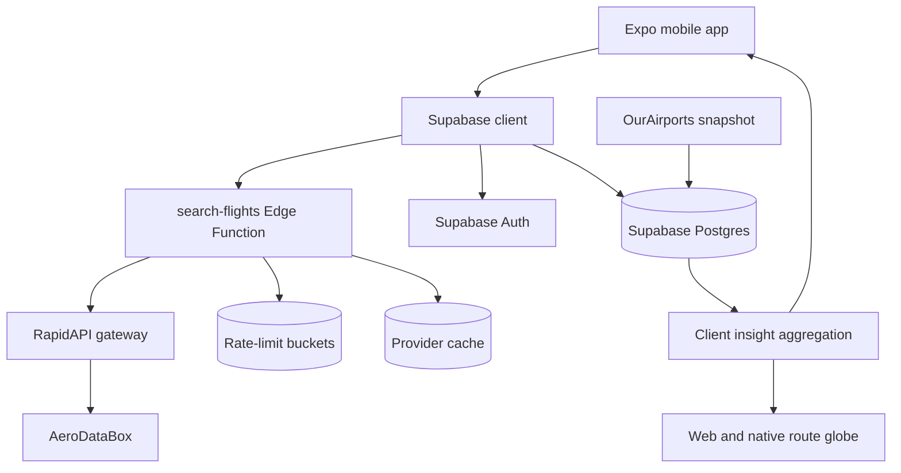
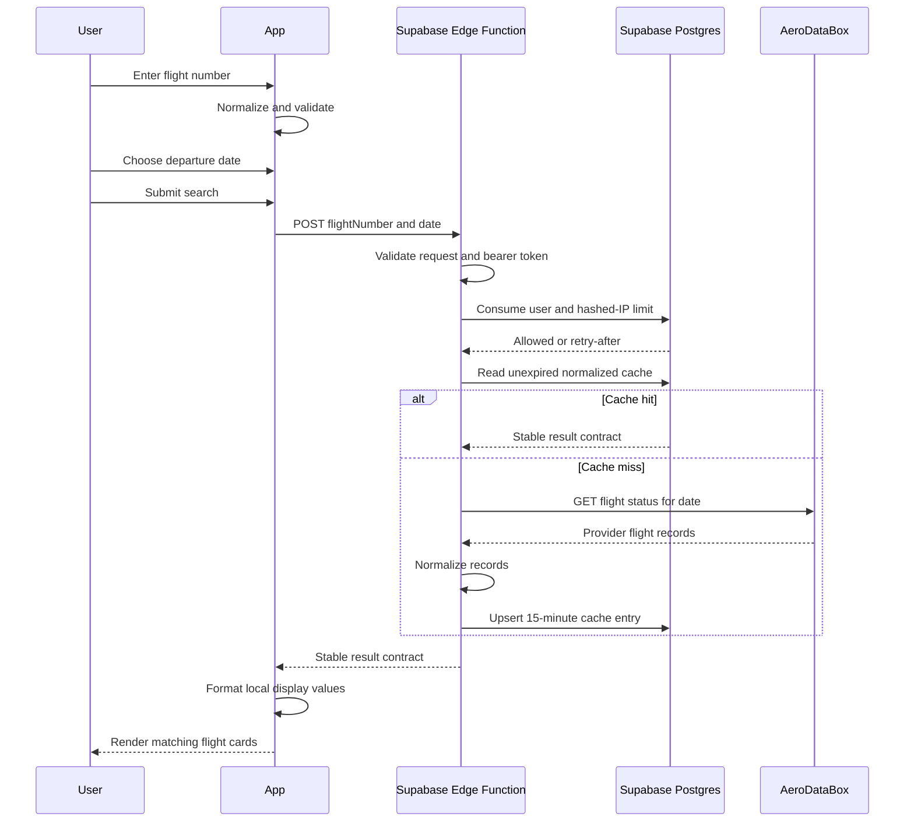
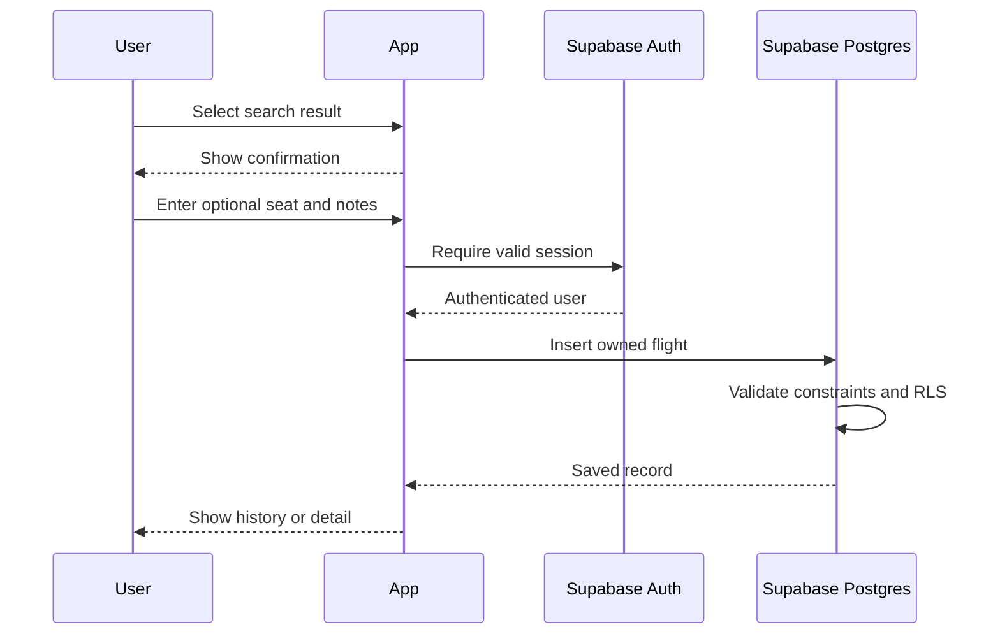

# Flight Tracker System Design

**Author:** Jace Kasen  
**Reviewers:** TBD  
**Status:** Phase 4 implementation complete; release artifact pending
**Last updated:** August 24, 2026
**Related document:** [`PRODUCT_REQUIREMENTS.md`](PRODUCT_REQUIREMENTS.md)

## 1. Document overview

### Overview

This document describes the technical design for Flight Tracker, an Expo mobile application that searches external aviation data through an authenticated Supabase Edge Function and persists private user flight history in Supabase Postgres.

Flighty was the primary product and interaction reference. This project began because recurring subscription prompts made that product a poor fit for the author's narrower personal needs. Flight Tracker is an independent personal-use implementation, not an attempt to claim an original product category or reproduce Flighty's full commercial service. It is not affiliated with or endorsed by Flighty. This document concentrates on the architecture and engineering decisions implemented in this repository.

The current implementation completes search, authenticated history, travel insights, and portfolio hardening:

```text
Expo app -> Supabase Auth -> Edge Function -> RapidAPI -> AeroDataBox
         -> Postgres with RLS -> private flight timeline
         -> airport enrichment -> all-time globe and separate recaps
         -> private export and cascading account deletion
Edge Function -> persistent user/IP limits -> normalized provider cache
GitHub Actions -> app, Edge Function, and database authorization checks
```

The remaining release task is to publish the configured demo or record the checked-in walkthrough.

### Introduction

Flight history combines several concerns that require explicit design:

- Flight numbers are reused across dates and may be codeshared.
- Departure and arrival use different local time zones.
- Historical provider coverage is incomplete.
- External API credentials cannot be shipped in a mobile bundle.
- Personal trips, seats, and notes must be isolated by user.
- The free provider has limited quota and no application-level reliability guarantee.

The architecture uses a provider-independent contract at the Edge Function boundary, UTC timestamps for storage and calculations, airport-local values for display, and Supabase RLS for ownership enforcement.

## 2. Goals and non-goals

### Goals

- Provide a secure server-side boundary for external flight lookup.
- Keep the mobile application independent of AeroDataBox response formats.
- Persist private flight history with enforceable user isolation.
- Correctly handle airport-local and UTC timestamps.
- Tolerate incomplete provider records and provider outages.
- Support manual records without requiring external data.
- Adapt the useful parts of the Flighty-inspired workflow to the author's personal needs.
- Keep the portfolio MVP operationally simple and inexpensive.
- Provide enough detail for implementation, testing, review, and maintenance.

### Non-goals

- Airline-grade uptime or operational accuracy.
- Continuous aircraft position ingestion.
- Push-based status alerts in the MVP.
- Booking, payment, check-in, or ticket management.
- Multi-region backend infrastructure.
- Premature microservice decomposition.
- A generalized aviation-data platform.
- Commercial competition or feature parity with Flighty.
- Reproducing Flighty's brand identity, proprietary assets, or subscription model.

## 3. System architecture

### High-level architecture



### Core components

#### 1. Mobile application

Technology:

- Expo SDK 54
- Expo Router
- React Native
- TypeScript
- Supabase JavaScript client
- Expo SQLite local-storage adapter
- React Native community date-time picker
- React Native Maps

Responsibilities:

- Navigation and presentation.
- Flight-number input and client-side validation.
- Native departure-date selection.
- Edge Function invocation.
- Search state and user-facing error handling.
- Flight result formatting.
- Authentication and persisted session state.
- Search-result confirmation and duplicate-safe saving.
- Timeline, flight details, editing, deletion, and manual entry.
- Globe-first Flights and Flight Insights experiences.
- Aggregate travel insights and a separate all-time/yearly Recap page.
- Portable JSON export and confirmed account deletion.

Key locations:

- `src/app/(tabs)/`
- `src/app/confirm.tsx`
- `src/app/manual.tsx`
- `src/app/flight/[id].tsx`
- `src/components/`
- `src/components/ui/`
- `src/components/route-map.tsx`
- `src/components/route-map.native.tsx`
- `src/hooks/use-auth-form.ts`
- `src/hooks/use-flight-collection.ts`
- `src/lib/flights.ts`
- `src/lib/flight-collections.ts`
- `src/lib/flight-search.ts`
- `src/lib/flight-number.ts`
- `src/lib/insights.ts`
- `src/lib/account.ts`
- `src/lib/supabase.ts`
- `src/providers/auth-provider.tsx`
- `src/types/`
- `scripts/generate-airport-migration.mjs`
- `supabase/migrations/`

Maintainability boundaries:

- Route files compose screens and keep screen-specific presentation local.
- Reusable controls live in `src/components/ui`; domain-specific components remain in `src/components`.
- Hooks own repeated asynchronous UI state, including session-aware flight loading and authentication forms.
- Pure formatting, validation, grouping, error, and route helpers live in focused `src/lib` modules.
- Supabase reads and writes remain behind integration modules such as `flights.ts`, `account.ts`, and `supabase.ts`.
- Provider normalization accepts `unknown` input and validates each field before producing the app-owned contract.

#### 2. Search Edge Function

Location:

- `supabase/functions/search-flights/index.ts`

Responsibilities:

- Accept POST and CORS preflight requests.
- Validate request shape, flight number, and date.
- Validate the bearer token against Supabase Auth.
- Normalize flight numbers.
- Consume persistent per-user and HMAC-hashed-IP rate limits.
- Return unexpired normalized cache entries without invoking the provider.
- Read the provider credential from Supabase secrets.
- Request the AeroDataBox single-day flight-status endpoint with an eight-second timeout.
- Disable unnecessary provider add-ons.
- Normalize provider data into an application-owned contract.
- Cache successful and empty normalized responses for 15 minutes.
- Translate provider failures into stable error codes.
- Emit structured outcome, cache, and latency logs without private flight data.

#### 3. Supabase Auth

Responsibilities:

- Create and authenticate users.
- Issue and refresh sessions.
- Send password-reset emails on an explicit user request.
- Supply the user identity used by RLS.
- Trigger profile creation.

Signed-out users are routed to the dedicated `auth` screen, which provides email/password login, account creation, password visibility controls, validation, actionable errors, and password-reset email requests. `AuthProvider` restores and observes the persisted Supabase session for the entire route tree. Expo Router `Stack.Protected` guards the tabs and authenticated detail screens; after authentication, users enter the Flights tab. The Profile tab owns sign-out and account-level data controls.

#### 4. Supabase Postgres

Responsibilities:

- Store profiles and personal flight records.
- Store read-only global airport coordinates and countries.
- Enrich new and existing flights with airport metadata and fallback route distance.
- Enforce field constraints and duplicate protection.
- Order history efficiently by user and departure.
- Enforce ownership through RLS.
- Store server-only provider cache records and persistent rate-limit buckets.
- Delete an authenticated account through a narrowly granted security-definer function.

#### 5. AeroDataBox through RapidAPI

Responsibilities:

- Return current, future, or historical flight information by number and date.
- Provide airports, times, status, airline, aircraft, and distance when available.

The provider is treated as an unreliable external dependency. Its payload is never exposed directly as the internal domain model.

## 4. Request flows

### Flight search sequence



### Save flight sequence



### History load sequence

1. Restore the Supabase session.
2. Query `flights` for the authenticated user.
3. Order by `scheduled_departure`.
4. Separate upcoming and completed flights in the client or query layer.
5. Render loading, empty, or error state and support pull-to-refresh.

### Insights load sequence

1. Restore the Supabase session and reuse the paginated, RLS-scoped `loadFlights()` query.
2. Build an all-time route set from every loaded flight with both endpoint coordinates.
3. Render that route set on the full-screen web or native globe, independent of the selected recap year.
4. Select all time or an origin-local departure year on the separate Recap page.
5. Prefer a stored provider distance, then calculate a Haversine fallback from airport coordinates.
6. Prefer a complete actual-time pair for duration; otherwise use scheduled UTC timestamps.
7. Count every selected flight while excluding missing optional values only from the affected metric.
8. Rank airlines, airport visits, country visits, and aircraft models in the client.

## 5. Detailed design

### Flight-number validation

Accepted normalized format:

```regex
^([A-Z0-9]{2}|[A-Z]{3})(\d{1,4}[A-Z]?)$
```

The two-character airline designator must contain at least one letter. This preserves the boundary when the designator itself includes a digit.

Examples:

- `UA 120` becomes `UA120`.
- `ua120` becomes `UA120`.
- `KL 1395` becomes `KL1395`.
- `3u 8633` becomes `3U8633`.
- `R3 501` becomes `R3501`.
- `F9 1191` becomes `F91191`.

Validation occurs on both the client and server:

- Client validation provides immediate feedback and avoids unnecessary calls.
- Server validation protects quota and cannot be bypassed by another caller.

### Date validation

The client sends `YYYY-MM-DD`.

The Edge Function:

1. Checks the exact string format.
2. Constructs a UTC date.
3. Compares the serialized date to the original input.

The third step rejects rollover values such as February 31.

### Time representation

Rules:

- Store canonical departure and arrival as UTC `timestamptz`.
- Calculate duration from UTC values.
- Store airport time-zone identifiers when available.
- Display departure in origin-local time.
- Display arrival in destination-local time.
- Never calculate duration by subtracting local wall-clock values.

Provider-local timestamps are parsed as wall-clock components for display so the device time zone does not shift them.

Priority for displayed time:

1. Revised or actual time.
2. Scheduled time.
3. Neutral placeholder.

### Search result contract

The Edge Function returns a provider-independent object:

```ts
type FlightSearchResult = {
  id: string;
  flightNumber: string;
  airlineName: string | null;
  airlineIata: string | null;
  status: string;
  origin: FlightEndpoint;
  destination: FlightEndpoint;
  departure: FlightTimes;
  arrival: FlightTimes;
  durationMinutes: number | null;
  distanceKm: number | null;
  aircraft: {
    model: string | null;
    reg: string | null;
  };
  isCargo: boolean;
  codeshareStatus: string | null;
};
```

All provider-optional fields are nullable. The app must not assume aircraft, gates, status updates, or actual times exist.

### Flight identity

A flight number alone is not unique.

The MVP identity should include:

- Authenticated user
- Operating flight number
- Origin airport
- Scheduled UTC departure

The database uniqueness constraint uses user, flight number, origin, and scheduled departure.

Codeshares should preserve:

- Marketing flight number searched by the user
- Operating airline and operating flight number when provided
- Provider codeshare status

### Client state

The search screen uses a small explicit state machine:

```ts
type SearchState =
  | { kind: 'idle' }
  | { kind: 'loading' }
  | { kind: 'error'; message: string }
  | {
      kind: 'results';
      flights: Array<{ result: FlightSearchResult; preview: FlightPreview }>;
    };
```

Search step is tracked separately as `flight` or `date`.

Selecting a result serializes the provider-independent result into the confirmation route. Confirmation and persistence maintain their own explicit loading and error states. If this flow grows further, move the route draft into a reducer-backed context instead of adding independent booleans.

## 6. Data model

### Current schema

#### `profiles`

```sql
create table public.profiles (
  id uuid primary key references auth.users(id) on delete cascade,
  full_name text,
  created_at timestamptz not null default now(),
  updated_at timestamptz not null default now()
);
```

#### `flights`

```sql
create table public.flights (
  id uuid primary key default gen_random_uuid(),
  user_id uuid not null references public.profiles(id) on delete cascade,
  flight_number text not null,
  airline_iata text,
  airline_name text,
  origin_iata text not null,
  destination_iata text not null,
  scheduled_departure timestamptz not null,
  scheduled_arrival timestamptz not null,
  actual_departure timestamptz,
  actual_arrival timestamptz,
  status text not null default 'scheduled',
  departure_terminal text,
  departure_gate text,
  arrival_terminal text,
  arrival_gate text,
  origin_time_zone text,
  destination_time_zone text,
  origin_latitude double precision,
  origin_longitude double precision,
  origin_country_code text,
  origin_country_name text,
  destination_latitude double precision,
  destination_longitude double precision,
  destination_country_code text,
  destination_country_name text,
  aircraft_model text,
  aircraft_registration text,
  distance_km numeric,
  operating_airline_iata text,
  operating_flight_number text,
  provider text,
  provider_record_id text,
  provider_retrieved_at timestamptz,
  seat text,
  notes text,
  is_manual boolean not null default false,
  created_at timestamptz not null default now(),
  updated_at timestamptz not null default now(),
  unique (user_id, flight_number, origin_iata, scheduled_departure)
);
```

The forward migration removes `confirmation_code`, permits either an airline code or name, validates airport and time fields, and adds the provider and manual-entry fields above. An index on `(user_id, scheduled_departure desc)` supports timeline queries.

#### `airports` and insight enrichment

Phase 3 adds a read-only `airports` reference table generated from the public-domain OurAirports scheduled-service dataset. It stores IATA code, airport and municipality names, ISO country and country name, coordinates, and an optional IANA time zone.

```sql
create table public.airports (
  iata text primary key,
  name text not null,
  municipality text,
  iso_country text not null,
  country_name text not null,
  latitude double precision not null,
  longitude double precision not null,
  time_zone text,
  created_at timestamptz not null default now(),
  updated_at timestamptz not null default now()
);
```

The table has RLS enabled with read access for authenticated users. The generated import currently contains 4,134 airports with scheduled service. `scripts/generate-airport-migration.mjs` downloads and deduplicates the source snapshot; a deployed import migration must remain immutable, so later refreshes require a new timestamped migration.

Optional origin and destination coordinate and country fields are denormalized onto each flight. A database trigger enriches future inserts, calculates a great-circle distance when provider distance is absent, and supports a one-time backfill after the airport import. Keeping the fields optional makes the migration backward compatible and allows unknown or newly opened airports to remain valid flight records.

The mobile client loads only the current user's flights through existing RLS. It derives one all-time route set for the globe, then independently filters the same rows for all-time or yearly Recap totals and rankings. This avoids a second user-owned aggregate surface for the portfolio scale while preserving the option to move aggregation into SQL later.

#### Phase 4 server-only tables and account deletion

`provider_search_cache` stores a normalized JSON response by `flight number:date` and an expiry timestamp. `search_rate_limit_buckets` stores fixed one-hour counters by user ID or HMAC-hashed IP. Both tables have RLS enabled, grant no client role access, and are used only through the Edge Function's server-side service-role client.

`consume_search_rate_limit(user_id, ip_hash)` atomically increments both counters and returns an allow decision plus retry delay. The configured thresholds are 10 valid searches per user and 30 per IP each hour. Old buckets are pruned opportunistically.

`delete_own_account()` is executable only by `authenticated`. It derives the user from `auth.uid()` and deletes that row from `auth.users`; existing foreign keys cascade to `profiles` and `flights`. The function is `security definer`, has an empty search path, accepts no caller-selected user ID, and exposes no administrative credential to the client.

Account export does not require a server-side administrative path. The client queries its own profile and paginates all RLS-visible flights, then serializes a versioned JSON document. Native builds write a temporary file and open the share sheet; web downloads a Blob.

### Canonical flight alternative

A future multi-user design may split:

- `flight_instances`: shared operational facts.
- `user_flights`: ownership, seat, notes, and personal metadata.

This reduces duplicate provider data and enables shared caching. It also adds joins, synchronization rules, and migration complexity. The selected MVP design keeps one user-owned `flights` table until real multi-user duplication justifies separation.

## 7. API design

### Search flight

**Function:** `search-flights`  
**Method:** `POST`  
**Authentication:** Required Supabase user token
**Content type:** `application/json`

Request:

```json
{
  "flightNumber": "UA120",
  "date": "2026-08-22"
}
```

Successful response:

```json
{
  "query": {
    "flightNumber": "UA120",
    "date": "2026-08-22"
  },
  "results": [
    {
      "id": "UA120-SFO-2026-08-22T15:00:00Z",
      "flightNumber": "UA 120",
      "status": "Expected",
      "origin": {
        "iata": "SFO",
        "timeZone": "America/Los_Angeles"
      },
      "destination": {
        "iata": "JFK",
        "timeZone": "America/New_York"
      },
      "durationMinutes": 332,
      "aircraft": {
        "model": "Boeing 777-200",
        "reg": null
      }
    }
  ]
}
```

No match is a successful response with an empty `results` array.

Error response:

```json
{
  "error": {
    "code": "invalid_flight_number",
    "message": "Enter a valid flight number, e.g. UA120."
  }
}
```

Stable error codes:

- `invalid_request`
- `invalid_flight_number`
- `invalid_date`
- `not_configured`
- `unauthorized`
- `rate_limited`
- `quota_exceeded`
- `upstream_error`
- `method_not_allowed`

### Save flight

No custom Edge Function is required for the MVP. The authenticated client may insert through the Supabase Data API because RLS enforces ownership.

Required implementation rules:

- Obtain the session before insertion.
- Set `user_id` to the authenticated user.
- Map only validated normalized fields.
- Treat duplicate-constraint failure as an existing-flight outcome.
- Never use the service-role key in the client.

## 8. Technical decisions and trade-offs

### Decision 1: Supabase Edge Function for provider lookup

#### Option A: Direct mobile request

Advantages:

- Least code.
- Lowest request latency.

Disadvantages:

- Ships the RapidAPI key in the app bundle.
- Allows uncontrolled key extraction and quota use.
- Couples the app to the provider response.

#### Option B: Supabase Edge Function — selected

Advantages:

- Keeps secrets server-side.
- Centralizes validation, error mapping, and normalization.
- Fits the existing Supabase infrastructure.
- Requires no separate server deployment.

Disadvantages:

- Adds one network hop.
- Public invocation still requires abuse controls.
- Deno code uses a separate runtime and type-checking path.

#### Option C: Dedicated backend service

Advantages:

- Maximum control over caching, observability, and rate limiting.

Disadvantages:

- Unnecessary infrastructure and operations for the portfolio MVP.

**Decision:** Use a Supabase Edge Function. Revisit only if operational requirements outgrow it.

### Decision 2: AeroDataBox through RapidAPI

#### AeroDataBox — selected

Advantages:

- Search by flight number and date.
- Historical and future schedules.
- Useful airport, status, aircraft, and distance fields.
- Free development allowance.

Disadvantages:

- Limited quota.
- Uneven coverage.
- Marketplace and provider dependency.

#### Community ADS-B sources

Advantages:

- Free or community-supported live aircraft positions.

Disadvantages:

- Poor fit for historical schedules, gates, cancellations, and future flights.

#### Other commercial APIs

Advantages:

- Potentially stronger coverage or SLAs.

Disadvantages:

- Paid plans conflict with the current free-only constraint.

**Decision:** Use AeroDataBox while preserving a provider-independent internal contract.

### Decision 3: PostgreSQL with RLS

#### PostgreSQL and Supabase RLS — selected

Advantages:

- Relational constraints fit flight history.
- Strong timestamp, indexing, and query support.
- RLS enforces ownership near the data.
- Existing Supabase integration reduces infrastructure.

Disadvantages:

- Schema changes require migrations.
- RLS policies require explicit testing.

#### Local-only storage

Advantages:

- Simple and offline-first.

Disadvantages:

- No cross-device history.
- Weak account isolation and recovery.

**Decision:** Use Postgres as the source of truth and add local caching later.

### Decision 4: UTC storage with airport-local display

#### UTC-only display

Advantages:

- Technically simple and unambiguous.

Disadvantages:

- Does not match how travelers read itineraries.

#### Device-local display

Advantages:

- Easy with standard date formatting.

Disadvantages:

- Displays incorrect airport times when the device is elsewhere.

#### UTC storage plus airport-local display — selected

Advantages:

- Correct calculations and traveler-facing presentation.

Disadvantages:

- Requires time-zone metadata and edge-case tests.

**Decision:** Store UTC, retain airport time zones, and display each endpoint locally.

### Decision 5: One user-owned flight table for MVP

Advantages:

- Minimal query and migration complexity.
- Natural fit for personal notes and manual corrections.

Disadvantages:

- Duplicates operational data across users.
- Limits shared provider caching.

**Decision:** Keep one table for the MVP. Split canonical and personal data only after multi-user evidence warrants it.

## 9. Security considerations

### Authentication

- Supabase Auth issues and refreshes user sessions.
- Session persistence uses Expo SQLite-backed local storage.
- Search requires an authenticated Supabase session.
- Saving, history, editing, deletion, export, and account deletion require authentication.

### Authorization

- `profiles` and `flights` have RLS enabled.
- Policies compare `auth.uid()` with the record owner.
- The application must test cross-user reads, writes, updates, and deletes.
- Backend administrative credentials must never reach the mobile client.

### Secrets

- `AERODATABOX_API_KEY` is stored in Supabase secrets.
- `RATE_LIMIT_IP_HASH_SECRET` is a separate random Supabase secret used only for IP HMACs.
- `SUPABASE_SERVICE_ROLE_KEY` is supplied by the Edge runtime and never returned or bundled.
- `EXPO_PUBLIC_` variables may contain only the Supabase project URL and publishable key.
- Provider errors and logs must not include request headers.

### Data privacy

- Flight history, seat, and notes are private user data.
- Confirmation codes should not be stored without a concrete requirement.
- Account deletion cascades from profile to flights.
- Export should include only the authenticated user's data.

### Abuse prevention

- Persistent database buckets limit valid searches to 10 per user and 30 per IP each hour.
- IP addresses are HMAC-hashed with a server-only secret before storage.
- The client rejects duplicate in-flight submissions and the server limits every valid request.
- Recent normalized lookups, including empty results, are cached for 15 minutes.
- Provider quota and 429 responses still require operational monitoring.

## 10. Reliability and edge cases

### Provider failures

- Timeout provider requests.
- Return stable errors rather than raw provider bodies.
- Do not retry user-triggered requests automatically without a strict limit.
- Preserve input so users can retry.
- Offer manual entry.

### Partial records

- Airport, aircraft, gate, actual time, or status may be absent.
- All optional contract fields remain nullable.
- Rendering uses placeholders and does not discard otherwise useful results.

### Flight edge cases

Test:

- Overnight flights.
- International date-line crossings.
- Daylight-saving transitions.
- Same flight number with multiple legs.
- Codeshare versus operating flight.
- Canceled and diverted flights.
- Arrival airport different from scheduled destination.
- Unknown aircraft.
- Manual records with no provider identifier.

### Quota exhaustion

- Return `quota_exceeded` for provider 429 responses.
- Display a temporary-unavailability message.
- Do not silently fall back to stale unrelated data.
- Preserve manual entry.

## 11. Monitoring and alerting

The Edge Function emits structured search outcome, cache, and latency logs without user IDs, flight details, or credentials. The MVP does not yet aggregate those logs into dashboards or alerts and has no mobile crash reporting; those operational integrations remain prerequisites for a broader production release.

### System metrics

- Edge Function invocation count.
- Search success, empty-result, validation-error, provider-error, and quota-error counts.
- Provider and total request latency.
- Database query and insertion failures.
- Mobile crash-free sessions.

### Product metrics

- Search-to-result conversion.
- Result-to-save conversion.
- Manual-entry fallback rate.
- Median time to save a flight.
- Saved flights per active user.

### Initial alert thresholds

- High priority: provider or Edge Function error rate exceeds 10% for 15 minutes.
- High priority: quota-exceeded errors occur before the expected monthly limit.
- Medium priority: p95 search latency exceeds five seconds for 15 minutes.
- Medium priority: repeated authorization-policy failures after a release.

No alert should include flight details, notes, seats, or credentials.

## 12. Testing strategy

Current automation includes 35 Vitest cases for flight-number parsing, search validation, provider normalization, duration, distance, rankings, partial records, origin-local yearly filtering, and shared utility behavior. Four Deno HTTP tests exercise the Edge Function's CORS, method, JSON, flight-number, and date-validation boundaries. The pgTAP suite verifies cross-user flight/profile isolation, server-only access to hardening tables and RPCs, and cascading account deletion. CI type-checks and tests the Edge Function. Mocked provider and authenticated integration paths, client component tests, and end-to-end device flows remain recommended follow-up coverage.

### Unit tests

- Flight-number normalization and validation.
- Strict date validation.
- Provider-response normalization.
- Local-time parsing and formatting.
- Duration calculation.
- Status formatting.
- Database mapping.
- Insight totals with complete and partial flight records.
- Stored-distance and coordinate-derived distance handling.
- Origin-local yearly filtering and date-line edge cases.
- Airline, airport, country, and aircraft rankings.

### Integration tests

- Edge Function CORS preflight and unsupported-method responses.
- Malformed JSON, flight-number, and date-validation responses.
- Follow-up: missing secret and authentication failures.
- Follow-up: provider 204, 400, 401, 429, 500, and malformed JSON.
- Supabase insert with authenticated user.
- Duplicate flight handling.
- RLS cross-user isolation.

### UI tests

- Flight number to date-picker progression.
- Validation error.
- Loading disables duplicate submission.
- Empty results.
- Provider error.
- Select, confirm, and save.
- History load and deletion.
- Insights authentication, loading, empty, and partial-data states.
- All-time globe rendering with every mapped route in loaded history.
- Separate all-time and yearly Recap selection.
- Native route rendering and projected web-globe paths.

### Required continuous checks

```sh
npm run lint
npm run typecheck
npm run test
npm run doctor
deno check supabase/functions/search-flights/index.ts
deno test supabase/functions/search-flights/index_test.ts
npx supabase test db
```

Vitest covers validation, provider normalization, time and distance calculations, partial data, origin-local yearly filtering, and rankings. Deno tests exercise the Edge Function's unauthenticated HTTP boundary. pgTAP verifies cross-user RLS, server-only hardening surfaces, and cascading account deletion. GitHub Actions runs all application checks, Edge Function type-checking and tests, and database tests for pull requests and pushes to `main`.

## 13. Migration and rollout plan

### Phase 1: Search prototype — complete

- Deploy the search proxy function.
- Store the provider secret in Supabase.
- Validate search manually on iOS and Android.
- Monitor provider quota through RapidAPI.

### Phase 2: Authenticated history — complete

1. Add schema fields through a forward migration.
2. Remove `confirmation_code` if no requirement exists.
3. Add authentication UI.
4. Implement save and timeline queries.
5. Test RLS with two separate users.
6. Require authentication for search before public distribution.

### Phase 3: Insights — complete

1. Import scheduled-service airport metadata from OurAirports.
2. Backfill coordinates, countries, and missing distances while preserving provider time zones.
3. Calculate private aggregate summaries in the client.
4. Display web/native all-time route globes and selectable yearly metrics on a separate Recap page.

### Phase 4: Portfolio hardening — implementation complete

1. Add persistent per-user and HMAC-hashed-IP search limits.
2. Cache normalized provider responses for 15 minutes.
3. Add private JSON export and cascading account deletion.
4. Add Vitest, pgTAP authorization tests, and GitHub Actions checks.
5. Check in a safe deployment and three-minute recording runbook.
6. Publish the final demo or recording URL as the release artifact.

### Rollback plan

Edge Function:

- Redeploy the last known-good function version.
- Disable search in the client if provider behavior changes.
- Preserve manual entry and saved history.

Database:

- Prefer additive, backward-compatible migrations.
- Do not remove columns until all deployed clients stop reading them.
- Back up data before destructive migrations.
- Roll back application code before attempting destructive schema reversal.

Mobile:

- Keep new data fields optional during staged rollout.
- Avoid requiring a new schema field until the migration is confirmed.
- Use clear minimum-version rules if an incompatible release becomes necessary.

## 14. Assumptions

- Supabase remains the backend platform for the portfolio MVP.
- AeroDataBox Basic remains available during development.
- The application initially serves a small number of users.
- Flight history is private by default.
- Manual entry is acceptable when provider data is unavailable.
- iOS and Android are the primary targets; web parity is secondary.

## 15. Open technical decisions

- Airport metadata refresh cadence before release.
- Client caching library and offline synchronization approach.
- When to split canonical flight instances from user-owned metadata.
- Monitoring provider and alert delivery.
